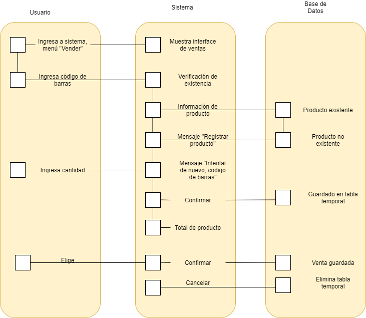

# Proceso de Ventas

Este es el proceso mediante el cual se registran las ventas realizadas

## Datos de entrada

- Código de barras de los productos
- Cantidad de los productos

## Elementos de salida

- Inventario/stock actualizado

## Actores

- Empleado
- Vendedor (externo)

## Roles

- Empleado

## Procedimiento

Para un procedimiento más detallado, ver [Caso de Uso de Ventas](../casos_de_uso/ventas.md)

1. Cliente ingresa al establecimiento, y realiza un pedido
2. El empleado ingresa al sistema, al apartado de Ventas.
3. El empleado registra los productos vendidos, incluyendo cantidad
4. La aplicación guarda la información actualizada del Stock
